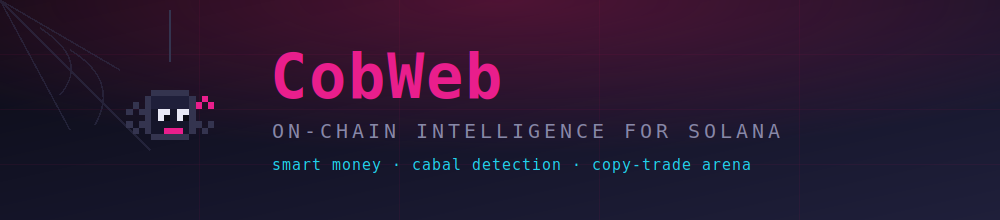

<<<<<<< HEAD
<p align="center">
  
</p>

<p align="center">
  <a href="https://cobwebscan.xyz"></a>
  
  
  
  
  
</p>

<h1 align="center">CobWeb 🕸️</h1>

<p align="center">
  <b>Who really bought a Solana token early — independent smart money, or a coordinated insider cabal?</b>
</p>

<p align="center">
  
  <br/>
  <sub><i>Meet Coby — he reads the on-chain threads so you don't have to.</i></sub>
</p>

---

Paste a token's **Contract Address**. CobWeb finds every wallet that bought near launch, reconstructs each entry price and market cap, then maps the hidden connections between them — shared funders, direct SOL transfers, synchronized buying. Independent traders get profiled (archetype, winrate, PnL). Coordinated groups get exposed as **clusters** with a suspicion score. And anyone can spin up a demo account to **copy-trade real wallets in a paper-trading arena** and climb the leaderboard.

> **Live:** [cobwebscan.xyz](https://cobwebscan.xyz) · pixel-art UI, real-time Solana data via Helius.

---

## ✨ What it does

### 🔍 Token X-ray
- **Early buyers, reconstructed** — every wallet in near launch, with entry market cap, USD position size, bot-score and smart-money-score. Categories are mutually exclusive: Smart Money / Cluster / Bot / Regular.
- **Cabal Web** — interactive force-directed graph of wallet relationships: shared funders, direct transfers, temporal clustering. CEX hot wallets (Binance, Bybit, OKX, Coinbase…) are recognized so two wallets that merely withdrew from the same exchange aren't falsely flagged as a coordinated group.
- **Live market context** — price, market cap, liquidity, venue. Listed tokens come from DexScreener; **fresh bonding-curve launches not on any DEX yet** get a volume-weighted price derived from their actual recent on-chain trades — so brand-new pump.fun tokens are covered too.
- **Holder concentration** — % of supply in the top 10 accounts, colour-coded rug-risk signal.
- **Dev Risk** — deployer history: prior launches, quick-sell patterns.
- **Lifecycle stage** — Wyckoff-style phase (accumulation / markup / distribution / dump) inferred from live trade flow.

### 👛 Wallet profiler
- **Archetype** — sniper / insider / flipper / swing trader / accumulator / bot.
- **Realized PnL** in SOL and USD per token, winrate, hold times. Parses both Jupiter-style swap events and raw pump.fun transfers.
- **Unrealized PnL** — open positions priced via batch lookup; unpriced fresh tokens are reported honestly, never silently zeroed.

### 🏆 Copy-trade arena
- **Demo accounts** — sign up with a nickname + password, get a **$1,000 demo balance** (pure paper money, nothing real, nothing to lose).
- **Follow real wallets** — add Solana wallets to your watchlist. When a followed wallet **buys**, the bot opens a virtual position sized by your settings; when it **sells**, the bot closes it and books the P&L onto your balance.
- **Leaderboard** — players ranked by total equity (cash + open positions marked to market). Who picked the best wallets to copy?
- **Reset** anytime back to $1,000.

### ⚡ Real-time copy-trade engine
- **Dynamic webhook tracking** — when a user follows a wallet, the backend pushes that wallet to a Helius webhook via the Helius API. The webhook then watches exactly the wallets people are copying — nothing more, keeping API usage tight.
- **Instant fills** — a watched wallet's buy/sell triggers the bot to open/close virtual positions in real time.
- **Request coalescing** — N users opening the same token trigger **one** deep scan (Redis singleflight), protecting the data-provider quota under load.

---

## 🧰 Stack

| Layer | Tech |
|---|---|
| **Backend** | Python 3.12 · FastAPI (async) · SQLAlchemy · PostgreSQL · Redis · Helius API |
| **Frontend** | Next.js 14 (App Router) · TypeScript · Tailwind · React Query |
| **Auth** | JWT sessions · bcrypt password hashing |
| **Infra** | Docker Compose · Caddy (automatic HTTPS) |

---

## 🚀 Quick start

```bash
# 1. Configure
cp .env.example backend/.env
# Edit backend/.env:
#   HELIUS_API_KEY  — get one at https://dev.helius.xyz
#   JWT_SECRET      — generate: openssl rand -hex 32

# 2. Run everything
docker compose up --build

# Frontend → http://localhost:3000
# API docs → http://localhost:8000/docs
```

For a deployed frontend, pass the public API URL at **build** time (Next.js inlines `NEXT_PUBLIC_*` during build):

```bash
NEXT_PUBLIC_API_URL=https://yourdomain.com/api docker compose up --build
```

---

## 🔌 Copy-trade webhook (optional)

The copy-trade bot is powered by a Helius webhook whose watched-address list
is managed automatically. Without it the app runs fine — accounts, analysis
and the leaderboard all work; trades simply won't fire.

1. Deploy CobWeb behind a public HTTPS domain.
2. In the [Helius dashboard](https://dashboard.helius.dev/webhooks) → **New Webhook**:
   - **Type:** Enhanced · **Transaction types:** ANY · **Network:** mainnet
   - **URL:** `https://yourdomain.com/webhooks/helius`
   - **Account addresses:** seed with any one address (the backend rewrites this list).
3. Put the webhook's **ID** in `HELIUS_WEBHOOK_ID`. Now every watchlist change
   re-syncs the webhook, and the bot trades as followed wallets do.

---

## 🎨 Design

Pixel-art aesthetic, cyberpunk pink-on-dark palette, and a pixel-spider mascot named **Coby** who greets you on the home page (idle bob, blink, a little wave). Wallets are nodes, connections are threads — the whole product is a web.

---

## ⚠️ Disclaimer

CobWeb is an analytics and **paper-trading** tool. Demo balances are virtual. Scores are heuristics over public on-chain data. **Nothing here is financial advice.**

<p align="center"><sub>Built with 🕸️ on Solana · data from Helius & DexScreener</sub></p>
=======
# yarzesss-CobWeb-Solana-on-chain-analytics
>>>>>>> ca954151a5a427513e845ea0f9f37149e0782e35
